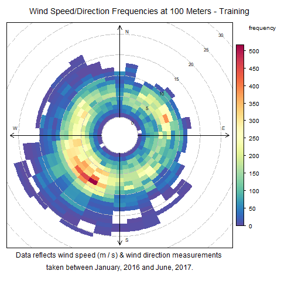

# BBDC Analysis and Modeling
This repo shows my work for the Bremen Big Data Challenge, including an R studio markdown file of my exploratory analysis and all models created.

The goal of the challenge, and my work, was to predict wind farm output, using training data containing the following information:
* Collected on 3 height levels (48M, 100M, 152M):
  * Wind Speed
  * Wind Direction
* Generated for the 100M height level:
  * Probabilistic wind speeds for the 10, 20, 30, 40, 50, 60, 70, 80, and 90th percentiles
* Farm Capacity
* Date
* Interpolated (Wind measurements were recorded only at given time intervals, so some observations in the data set have been linearly interpolated. This boolean variable flags whether an observation was interpolated, or observed.)

### Data
The data used in this analysis can be downloaded from the [BBDC website](https://bbdc.csl.uni-bremen.de/index.php/2018h/23-aufgabenstellung-2018). Note that the website, the data files, and the competition explanatory README file are all in German.

## General Overview
Using wind farm data collected between January 2016, and June 2017 I worked to predict the output of that same farm in Jully-December of 2017. To this end I preformed some minor exploratory analysis to better understand the behavior of the farm, before creating various models to predic the output.

The challenge administrators provided both a training and challenge set, where the challenge set had all output observations set to NULL. Predictions were then submitted through the challenge website, and validated against the "validation set", which was identical to the challenge set, excluding that the observations were available to the administrators. I requested the validation set after the challenge closed, to continue my analysis. As such, models are built and trained, in the analysis in this repo, using the full training set, and validated against the validation set.

In the original contest modeling, I used a test/train split created from the training set. I may include this work at a later point, but I find the later analysis to be more comprehensive, and so (for now at least) it alone is detailed here.

### Exploratory Analysis
Throughout the exploratory analysis I reviewed the distribution of the various features in the data set and, most interestingly, found that the majority of the winds measured for both the training and validation data were blowing in a south-westenly direction. Plots of the wind speed and wind direction frequencies (shown below) also show that the majority of the winds were recorded at speeds between 5 and 15 meters/second, with an average increase of 1 meter/second at the various recording heights.

## Requirements
The required libraries for this analysis are listed in the `libraries.txt` file. Each is listed as `install.packages("LIBRARY")`, such that the body of the file can be copied directly into R and then run, installing all necessary libraries.
A simmilar list of the necessary libraries can be found in the `PresentationCode.Rmd` file.
